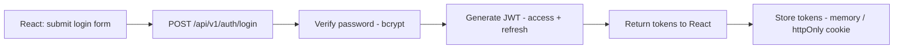
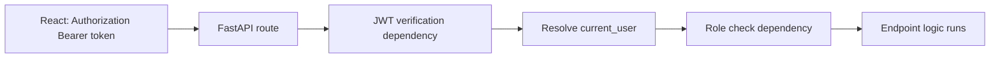
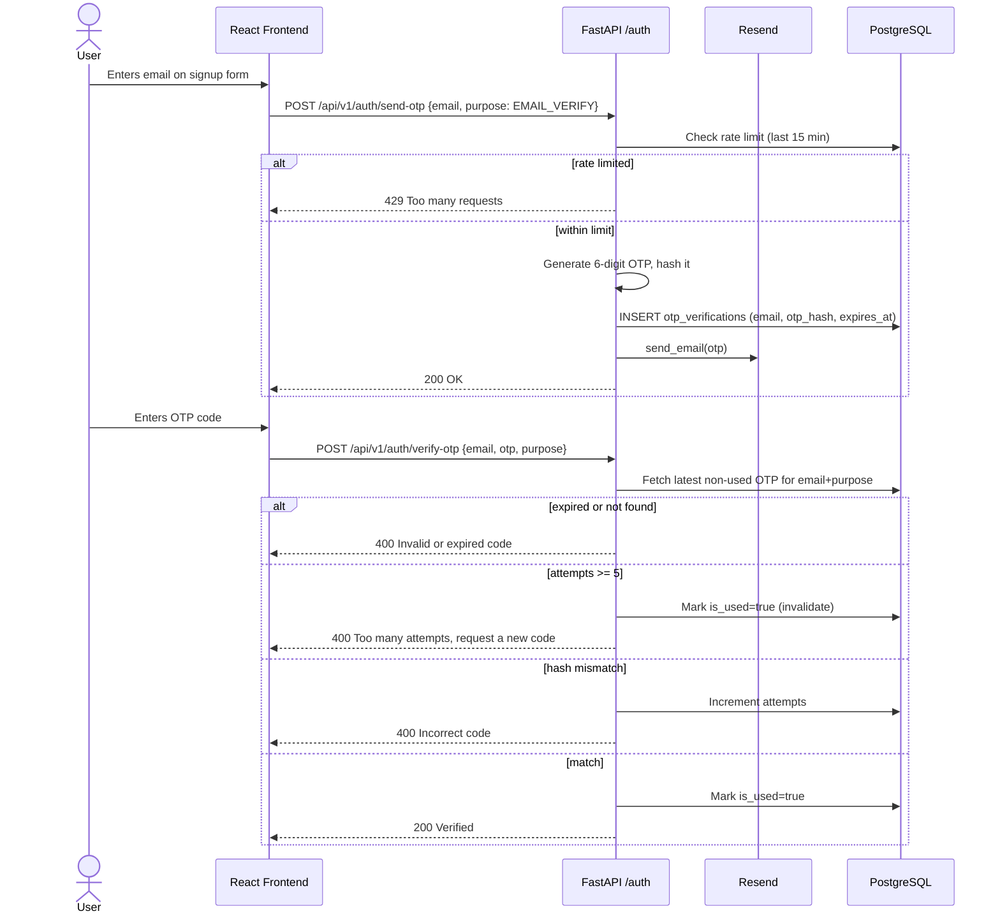
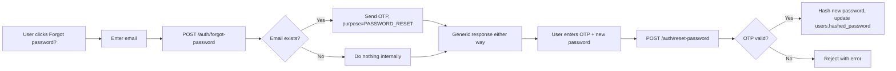
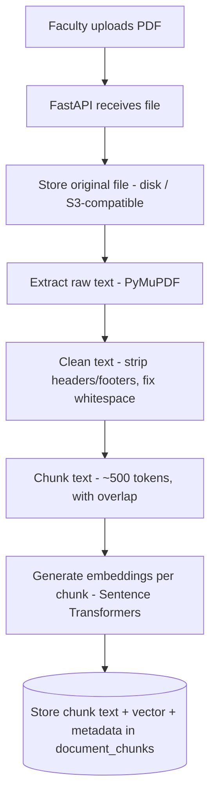
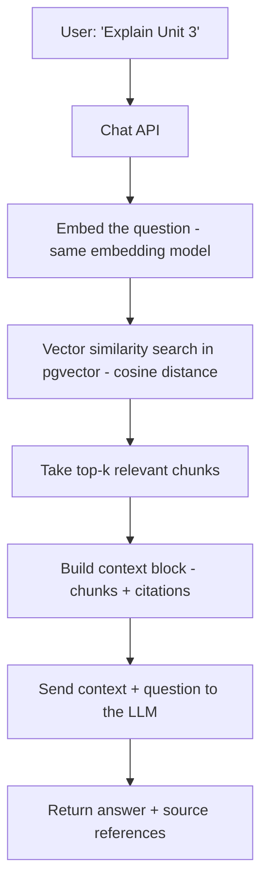
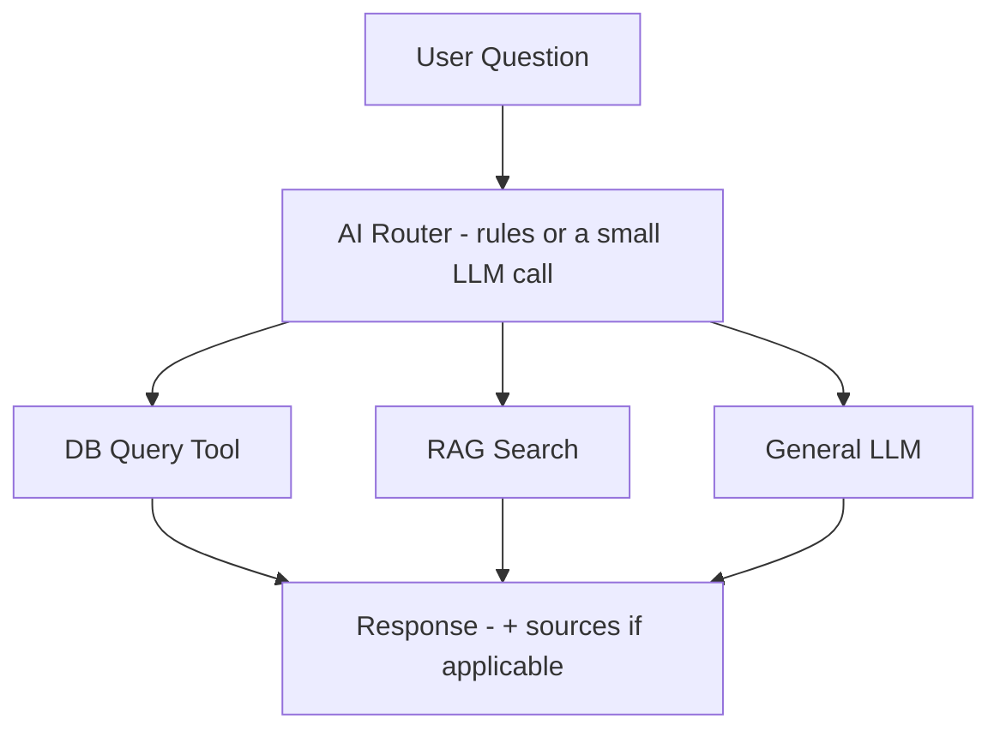

# CampusGPT — Architecture

This document is the source of truth for CampusGPT's system design. Keep it updated as the project evolves, and feed the relevant section to your AI coding tool (Antigravity, GitHub Copilot, Claude, etc.) at the start of each build phase so generated code stays consistent.

> For table-level schema details, see [`DB_SCHEMA.md`](./DB_SCHEMA.md).
> For the full set of UML class diagrams, sequence diagrams, and flowcharts (including modules not diagrammed inline below — attendance, timetable, assignments, notices, notifications, and state diagrams), see [`UML_DIAGRAMS.md`](./UML_DIAGRAMS.md).

---

## Table of Contents

1. [System Overview](#1-system-overview)
2. [Tech Stack](#2-tech-stack)
3. [Project Structure](#3-project-structure)
4. [Backend Architecture](#4-backend-architecture)
5. [Authentication & RBAC](#5-authentication--rbac)
6. [RAG Architecture](#6-rag-architecture)
7. [AI Chatbot Architecture](#7-ai-chatbot-architecture)
8. [API Reference](#8-api-reference)
9. [Frontend Architecture](#9-frontend-architecture)
10. [Dashboards](#10-dashboards)
11. [Production Security Checklist](#11-production-security-checklist)
12. [Build Roadmap (11 Phases)](#12-build-roadmap-11-phases)
13. [Prompting AI Tools Per Module](#13-prompting-ai-tools-per-module)
14. [Key Architectural Decisions](#14-key-architectural-decisions)

📐 Companion file: [`UML_DIAGRAMS.md`](./UML_DIAGRAMS.md) — domain class diagram (UML) + flow/sequence diagrams for every module.

---

## 1. System Overview

CampusGPT is a full-stack Campus Management System with an AI layer on top. Three roles — **Student**, **Faculty**, **Admin** — use a shared React frontend backed by a single FastAPI service. The system covers standard ERP modules (attendance, timetable, assignments, notices, documents, analytics) plus an AI assistant that can:

- Answer questions from uploaded course documents (RAG)
- Answer questions about the user's own data (database tool calls)
- Answer general knowledge questions (direct LLM)

```
Frontend (React + Tailwind)
        │  REST API / WebSocket
        ▼
Backend (FastAPI)
        ├── JWT Authentication
        ├── User & RBAC
        ├── Attendance
        ├── Timetable
        ├── Assignments
        ├── Notices
        ├── Documents
        ├── Analytics
        └── AI / RAG
                ├── Document Processing
                ├── Embeddings
                ├── Retrieval
                └── LLM
        ▼
PostgreSQL (+ pgvector)
```

---

## 2. Tech Stack

| Layer | Technology | Purpose |
|---|---|---|
| Frontend | React 18, Vite, Tailwind CSS | SPA UI, dashboards, chat window |
| Backend | FastAPI (Python 3.11+) | REST API, business logic, auth |
| ORM | SQLAlchemy 2.0 + Alembic | Models & migrations |
| Database | PostgreSQL 15/16 + `pgvector` | Relational data + vector search in one DB |
| Auth | JWT (access + refresh), passlib/bcrypt | Stateless auth, password hashing |
| OAuth | Authlib | Google OAuth 2.0 / OpenID Connect (domain-restricted sign-in) |
| Transactional email | Resend | OTP delivery for email verification & password reset |
| Document parsing | PyMuPDF (fitz) | Extract text from uploaded PDFs |
| Embeddings | Sentence Transformers (local) or an embeddings API | Text chunks → vectors |
| LLM | Claude API (or any LLM API) | Answer generation, chat, tool routing |
| Realtime | WebSocket or Server-Sent Events | Streaming chat responses |
| Containerization | Docker + Docker Compose | Local dev parity & deployment |
| Reverse proxy | Nginx | HTTPS, routing frontend/backend |
| CI/CD | GitHub Actions | Test + deploy pipeline |

**Deliberately deferred:** LangChain/LangGraph, a separate vector DB (Qdrant/Pinecone), and face recognition — see [Key Architectural Decisions](#14-key-architectural-decisions).

---

## 3. Project Structure

```
campusgpt/
│
├── frontend/
│   ├── public/
│   └── src/
│       ├── assets/
│       ├── components/{ui, common, navbar, sidebar, charts}/
│       ├── pages/{auth, student, faculty, admin}/
│       ├── features/{attendance, timetable, assignments,
│       │             notices, documents, chatbot, analytics}/
│       ├── hooks/
│       ├── services/{api.js, auth.js, chatbot.js}
│       ├── context/
│       ├── routes/
│       ├── utils/
│       ├── constants/
│       ├── App.jsx
│       └── main.jsx
│
├── backend/
│   └── app/
│       ├── main.py
│       ├── core/{config.py, security.py, dependencies.py, logging.py}
│       ├── database/{session.py, base.py, models/}
│       ├── auth/{router.py, schemas.py, service.py, repository.py, dependencies.py, oauth.py}
│       ├── users/
│       ├── attendance/
│       ├── timetable/
│       ├── assignments/
│       ├── notices/
│       ├── documents/
│       ├── rag/
│       ├── chat/
│       ├── analytics/
│       └── notifications/
│
├── docker-compose.yml
└── .env
```

---

## 4. Backend Architecture

Every feature module follows the same four-layer pattern, keeping `router.py` small and testable:

```
Router      → handles HTTP verbs/paths, calls the Service
Schema      → Pydantic models validating request/response shapes
Service     → business logic
Repository  → raw database operations (SQLAlchemy)
```

Example — attendance module:

```
attendance/
├── router.py       # POST /attendance, GET /attendance
├── schemas.py       # AttendanceCreate, AttendanceOut, ...
├── service.py       # mark_attendance(), calculate_percentage(), ...
└── repository.py    # DB inserts/selects for attendance tables
```

> When prompting an AI tool to build a module, always require it to follow this exact four-file pattern and reuse naming conventions from earlier modules.

---

## 5. Authentication & RBAC

### Login flow



### Authenticated request flow



> 🔎 Full sequence diagrams (registration, login, RBAC guard, token refresh) are in [`UML_DIAGRAMS.md §2`](./UML_DIAGRAMS.md#2-auth--rbac-sequence-diagrams).

### Roles

- `ADMIN`
- `FACULTY`
- `STUDENT`

**Rules:**
- Never put sensitive data in the JWT payload — identity claims only (user id, role, expiry).
- Every protected route independently verifies permissions server-side.

### 5.1 Email Verification (OTP)

New accounts must verify their email before logging in (local email+password path only — Google OAuth accounts are pre-verified by Google, see §5.3). A 6-digit numeric OTP is generated, hashed, and stored in `otp_verifications` (see `DB_SCHEMA.md` §1), and emailed via Resend.

**Security rules:**
- OTP is 6 digits, expires in 10 minutes, single-use
- OTP is hashed before storage — never stored or logged in plaintext
- Rate limit: max 3 OTP sends per email+purpose per 15 minutes
- Max 5 verification attempts per OTP; exceeding this invalidates the code and requires a new send
- Inline verification during signup (before the account is created) stores the OTP keyed by `email` with `user_id = null`; post-registration flows (e.g. password reset) key by `user_id`



### 5.2 Forgot Password

Reuses the same `otp_verifications` mechanism with `purpose = PASSWORD_RESET`, keyed by `user_id` once the account exists.



**Security rule:** the `forgot-password` response is identical whether or not the email exists in the system — this prevents user enumeration (an attacker probing which emails are registered).

### 5.3 Google OAuth (Domain-Restricted)

Users may alternatively sign in via Google, restricted to email domains listed in `ALLOWED_EMAIL_DOMAINS` (e.g. `vit.edu`). This is a second entry point into the *same* JWT-issuing system — every downstream dependency (`get_current_user`, `require_role`) behaves identically regardless of which method was used to authenticate.

**Rules:**
- Google's `email_verified` claim must be `true`, or the login is rejected
- The email domain must exactly match an entry in `ALLOWED_EMAIL_DOMAINS` — enforced **server-side only**, never trusted from the frontend
- If an email already exists as a `LOCAL` account, the Google identity is linked to it (sets `google_id`) rather than creating a duplicate user
- New Google sign-ins create a user with `auth_provider = GOOGLE`, `is_email_verified = true`, `hashed_password = null`

```mermaid
sequenceDiagram
    actor User
    participant FE as React Frontend
    participant API as FastAPI /auth
    participant Google as Google OAuth
    participant DB as PostgreSQL

    User->>FE: Clicks "Continue with Google"
    FE->>API: GET /api/v1/auth/google/login
    API->>Google: Redirect to consent screen
    Google-->>User: Consent screen
    User->>Google: Approves
    Google->>API: GET /auth/google/callback?code=...
    API->>Google: Exchange code for tokens
    Google-->>API: ID token (email, email_verified, name, picture, sub)

    alt email_verified is false
        API-->>FE: 403 Email not verified
    else domain not in ALLOWED_EMAIL_DOMAINS
        API-->>FE: 403 Only @vit.edu accounts are allowed
    else allowed
        API->>DB: Find user by email
        alt found, auth_provider=LOCAL
            API->>DB: Link google_id to existing account
        else found, auth_provider=GOOGLE
            API->>DB: Return existing user
        else not found
            API->>DB: Create user (auth_provider=GOOGLE, is_email_verified=true)
        end
        API->>API: Issue JWT (access + refresh) — same issuer as local login
        API-->>FE: Redirect with tokens
    end
```



> 🔎 See [`UML_DIAGRAMS.md` §2.4–2.6](./UML_DIAGRAMS.md#2-auth--rbac-sequence-diagrams) for these three flows in full alongside the original registration/login/refresh diagrams.

---

## 6. RAG Architecture

RAG (Retrieval-Augmented Generation) lets the LLM answer using the campus's actual documents instead of only general training knowledge.

### 6.1 Ingestion pipeline



### 6.2 Query pipeline



> Build this pipeline manually first (no LangChain) — see [Key Architectural Decisions](#14-key-architectural-decisions). Schema details in `DB_SCHEMA.md`.
> 🔎 Sequence-level detail (including the per-chunk embedding loop) is in [`UML_DIAGRAMS.md §7–8`](./UML_DIAGRAMS.md#7-document-upload--rag-ingestion-pipeline).

---

## 7. AI Chatbot Architecture

The chatbot never accesses every database table directly, and never sends every question through RAG. An intent router decides where a question goes:



| Example question | Routed to |
|---|---|
| "What is my attendance?" | Database Tool (structured query) |
| "Explain Unit 3 of DBMS." | RAG (search uploaded course documents) |
| "Explain polymorphism." | General LLM |

> 🔎 Full router sequence diagram (with the alt/else branching per intent) is in [`UML_DIAGRAMS.md §9`](./UML_DIAGRAMS.md#9-ai-chatbot-intent-router).

---

## 8. API Reference

All routes versioned under `/api/v1/`.

### Authentication
```
POST   /api/v1/auth/register
POST   /api/v1/auth/login
POST   /api/v1/auth/refresh
POST   /api/v1/auth/logout
GET    /api/v1/auth/me

# Email verification & password reset (OTP-based)
POST   /api/v1/auth/send-otp          # body: { email, purpose: EMAIL_VERIFY | PASSWORD_RESET }
POST   /api/v1/auth/verify-otp        # body: { email, otp, purpose }
POST   /api/v1/auth/forgot-password   # body: { email } — always returns a generic response
POST   /api/v1/auth/reset-password    # body: { email, otp, new_password }

# Google OAuth (domain-restricted, e.g. @vit.edu)
GET    /api/v1/auth/google/login      # redirects to Google's consent screen
GET    /api/v1/auth/google/callback   # handles the redirect back, issues JWT
```

### Users (admin-protected)
```
GET    /api/v1/users
GET    /api/v1/users/{id}
PATCH  /api/v1/users/{id}
DELETE /api/v1/users/{id}
```

### Students
```
GET /api/v1/students/me
GET /api/v1/students/{id}
GET /api/v1/students/{id}/attendance
GET /api/v1/students/{id}/assignments
GET /api/v1/students/{id}/timetable
```

### Faculty
```
GET /api/v1/faculty/me
GET /api/v1/faculty/{id}/students
GET /api/v1/faculty/{id}/subjects
```

### Attendance
```
POST /api/v1/attendance/sessions
GET  /api/v1/attendance/sessions
POST /api/v1/attendance/records
GET  /api/v1/attendance/student/{student_id}
GET  /api/v1/attendance/subject/{subject_id}
POST /api/v1/attendance/face/recognize      # later phase, optional
```

### Timetable
```
GET    /api/v1/timetable
GET    /api/v1/timetable/student/{id}
GET    /api/v1/timetable/faculty/{id}
POST   /api/v1/timetable
PATCH  /api/v1/timetable/{id}
DELETE /api/v1/timetable/{id}
```

### Assignments
```
POST   /api/v1/assignments
GET    /api/v1/assignments
GET    /api/v1/assignments/{id}
PATCH  /api/v1/assignments/{id}
DELETE /api/v1/assignments/{id}
POST   /api/v1/assignments/{id}/submit
GET    /api/v1/assignments/{id}/submissions
```

### Notices
```
POST   /api/v1/notices
GET    /api/v1/notices
GET    /api/v1/notices/{id}
PATCH  /api/v1/notices/{id}
DELETE /api/v1/notices/{id}
```

### Documents / RAG
```
POST   /api/v1/documents/upload
GET    /api/v1/documents
GET    /api/v1/documents/{id}
DELETE /api/v1/documents/{id}
POST   /api/v1/rag/query
POST   /api/v1/rag/search
```

### AI Chat
```
POST   /api/v1/chat
GET    /api/v1/chat/sessions
GET    /api/v1/chat/sessions/{id}
GET    /api/v1/chat/sessions/{id}/messages
DELETE /api/v1/chat/sessions/{id}
WS     /api/v1/chat/ws          # or SSE, for streaming
```

### Analytics
```
GET /api/v1/analytics/student
GET /api/v1/analytics/faculty
GET /api/v1/analytics/admin
GET /api/v1/analytics/attendance
GET /api/v1/analytics/assignments
```

### Notifications
```
GET   /api/v1/notifications
PATCH /api/v1/notifications/{id}/read
POST  /api/v1/notifications
```

---

## 9. Frontend Architecture

Organize React around **features**, not just pages, so each domain owns its components, API calls, and helpers:

```
features/
├── attendance/
│   ├── AttendanceCard.jsx
│   ├── AttendanceChart.jsx
│   ├── attendanceApi.js
│   └── attendanceUtils.js
├── timetable/
│   ├── Timetable.jsx
│   ├── ScheduleCard.jsx
│   └── timetableApi.js
└── chatbot/
    ├── ChatWindow.jsx
    ├── Message.jsx
    ├── ChatInput.jsx
    └── chatApi.js
```

`pages/` compose these features per role. `routes/` maps URLs to pages with role guards driven by JWT claims from `context/`.

---

## 10. Dashboards

| Student Dashboard | Faculty Dashboard | Admin Dashboard |
|---|---|---|
| Attendance | Classes | Users |
| Today's Classes | Students | Students |
| Assignments | Attendance | Faculty |
| Notices | Assignments | Departments |
| Upcoming Exams | Notices | Subjects |
| Performance | Documents | Timetables |
| CampusGPT chat | Analytics | Notices |
| | | System Analytics |

---

## 11. Production Security Checklist

- **Auth:** JWT with expiry, bcrypt password hashing, refresh token rotation
- **Authorization:** role check on every protected endpoint — never inferred from the frontend
- **OTP:** hashed at rest, 10-minute expiry, single-use, rate-limited (3/15min), capped attempts (5)
- **OAuth:** email domain restriction enforced server-side only; `email_verified` checked before trusting any Google identity; OAuth credentials never hardcoded
- **API security:** CORS allow-list, rate limiting, strict Pydantic input validation
- **File uploads:** validate type/size server-side, never trust client-supplied filenames, store with generated names
- **Database:** parameterized queries only (SQLAlchemy handles this)
- **Secrets:** environment variables only, never committed (`RESEND_API_KEY`, `GOOGLE_CLIENT_ID`, `GOOGLE_CLIENT_SECRET`)
- **User enumeration:** `forgot-password` returns an identical response regardless of whether the email exists

---

## 12. Build Roadmap (11 Phases)

| Phase | Focus | Outcome |
|---|---|---|
| 1 | Foundation | Git, FastAPI, React, PostgreSQL wired together; one working CRUD endpoint |
| 2 | Authentication | Register → login → JWT → current user → RBAC |
| 3 | Core ERP | Users → Departments → Students/Faculty → Subjects → Timetable → Attendance → Assignments → Notices |
| 4 | Dashboards | Student / Faculty / Admin UIs wired to real APIs |
| 5 | Documents | Upload → storage → text extraction → metadata |
| 6 | RAG ⭐ | Chunking → embeddings → pgvector search → context → LLM answer |
| 7 | AI Chatbot | Router combining DB tools + RAG + general LLM |
| 8 | Analytics | Charts per role (Recharts) |
| 9 | Face Recognition *(optional)* | Isolated module — different perf/privacy profile |
| 10 | Advanced AI *(optional)* | Voice, study planner, recommendations, multilingual |
| 11 | Production | Docker, Nginx, HTTPS, CI/CD, monitoring, backups |

Each phase should end with something runnable and testable before the next begins.

---

## 13. Prompting AI Tools Per Module

Reusable template for Antigravity, GitHub Copilot Chat, or Claude:

```
I'm building [module name] for CampusGPT, a FastAPI + React + PostgreSQL
(pgvector) project. Here is the relevant slice of the architecture:

[paste the relevant entities / endpoints / folder structure from ARCHITECTURE.md]

Here is the code already written in previous modules (for consistency):
[paste auth/core/database boilerplate, or relevant existing files]

Please generate [router.py / schemas.py / service.py / repository.py]
for this module, following the same four-layer pattern as the existing
modules. Use SQLAlchemy 2.0 style and Pydantic v2. Include docstrings
and basic input validation. Do not invent new folder names or
conventions not already used in the project.
```

Give the AI tool only what's relevant to the current module plus shared boilerplate — not the whole project at once. After generating each module, run it and check it against the API list in Section 8 before moving on.

---

## 14. Key Architectural Decisions

- **PostgreSQL + pgvector instead of a separate vector DB** — one database to run, back up, and query for the first production version. Migrate to Qdrant only if scale actually requires it.
- **No LangChain/LangGraph at first** — build the RAG pipeline by hand so every step (embedding, chunking, retrieval, context building) is understood. Introduce a framework later for reusable components, LangGraph specifically only for stateful/agentic workflows.
- **Router pattern for the chatbot** — prevents the LLM from improvising database access, which is both unreliable and a security risk. Structured data questions go through real, permissioned queries.
- **Feature-based frontend structure** — scales better than a flat pages/components split once there are 7+ domains.
- **Four-layer backend pattern** (router/schema/service/repository) — keeps individual files small and testable as the API surface grows past 40+ endpoints.
