# 📐 CampusGPT — UML & Flow Diagrams

This file is the visual companion to [`ARCHITECTURE.md`](./ARCHITECTURE.md). It collects all class-level UML diagrams and process-level flow/sequence diagrams in one place so they're easy to find, review, and keep in sync as the system evolves.

> All diagrams use [Mermaid](https://mermaid.js.org/) syntax and render natively on GitHub. If you use them in an AI coding prompt, paste the relevant block alongside the matching section of `ARCHITECTURE.md`.

---

## Table of Contents

1. [Domain Class Diagram (ERD-style UML)](#1-domain-class-diagram-erd-style-uml)
2. [Auth & RBAC Sequence Diagrams](#2-auth--rbac-sequence-diagrams)
3. [Attendance Flow](#3-attendance-flow)
4. [Timetable Flow](#4-timetable-flow)
5. [Assignment Lifecycle](#5-assignment-lifecycle)
6. [Notices Flow](#6-notices-flow)
7. [Document Upload & RAG Ingestion Pipeline](#7-document-upload--rag-ingestion-pipeline)
8. [RAG Query Pipeline](#8-rag-query-pipeline)
9. [AI Chatbot Intent Router](#9-ai-chatbot-intent-router)
10. [Notifications Flow](#10-notifications-flow)
11. [Backend Request Lifecycle (Four-Layer Pattern)](#11-backend-request-lifecycle-four-layer-pattern)
12. [State Diagrams](#12-state-diagrams)

---

## 1. Domain Class Diagram (ERD-style UML)

High-level entity relationships across the whole system. This is a conceptual UML view — see [`DB_SCHEMA.md`](./DB_SCHEMA.md) for exact column types, constraints, and indexes.

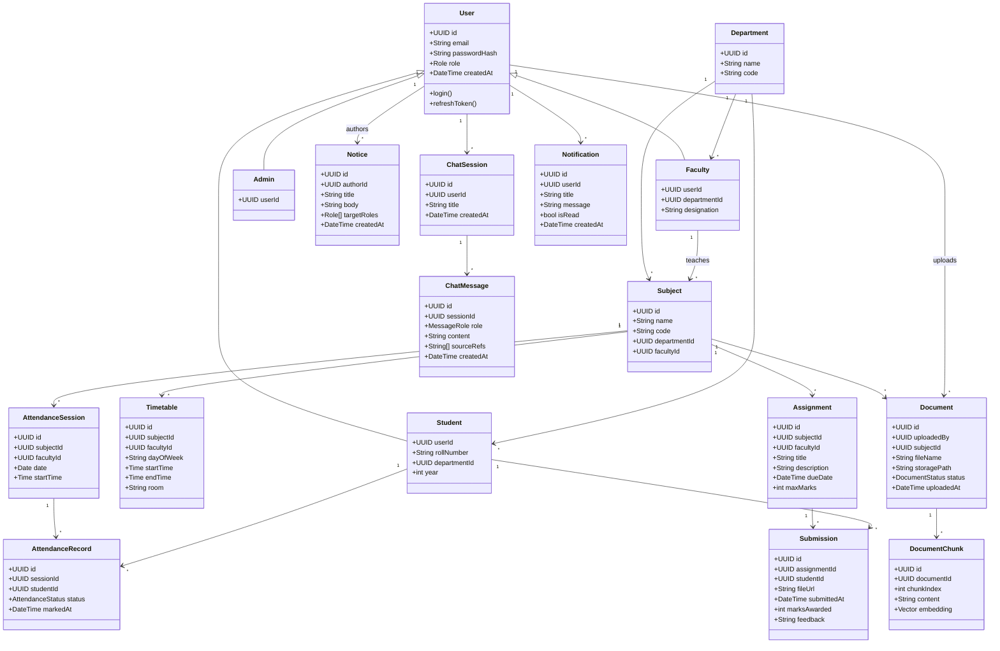
```mermaid
classDiagram
    class User {
        +UUID id
        +String email
        +String passwordHash
        +Role role
        +DateTime createdAt
        +login()
        +refreshToken()
    }

    class Student {
        +UUID userId
        +String rollNumber
        +UUID departmentId
        +int year
    }

    class Faculty {
        +UUID userId
        +UUID departmentId
        +String designation
    }

    class Admin {
        +UUID userId
    }

    class Department {
        +UUID id
        +String name
        +String code
    }

    class Subject {
        +UUID id
        +String name
        +String code
        +UUID departmentId
        +UUID facultyId
    }

    class Timetable {
        +UUID id
        +UUID subjectId
        +UUID facultyId
        +String dayOfWeek
        +Time startTime
        +Time endTime
        +String room
    }

    class AttendanceSession {
        +UUID id
        +UUID subjectId
        +UUID facultyId
        +Date date
        +Time startTime
    }

    class AttendanceRecord {
        +UUID id
        +UUID sessionId
        +UUID studentId
        +AttendanceStatus status
        +DateTime markedAt
    }

    class Assignment {
        +UUID id
        +UUID subjectId
        +UUID facultyId
        +String title
        +String description
        +DateTime dueDate
        +int maxMarks
    }

    class Submission {
        +UUID id
        +UUID assignmentId
        +UUID studentId
        +String fileUrl
        +DateTime submittedAt
        +int marksAwarded
        +String feedback
    }

    class Notice {
        +UUID id
        +UUID authorId
        +String title
        +String body
        +Role[] targetRoles
        +DateTime createdAt
    }

    class Document {
        +UUID id
        +UUID uploadedBy
        +UUID subjectId
        +String fileName
        +String storagePath
        +DocumentStatus status
        +DateTime uploadedAt
    }

    class DocumentChunk {
        +UUID id
        +UUID documentId
        +int chunkIndex
        +String content
        +Vector embedding
    }

    class ChatSession {
        +UUID id
        +UUID userId
        +String title
        +DateTime createdAt
    }

    class ChatMessage {
        +UUID id
        +UUID sessionId
        +MessageRole role
        +String content
        +String[] sourceRefs
        +DateTime createdAt
    }

    class Notification {
        +UUID id
        +UUID userId
        +String title
        +String message
        +bool isRead
        +DateTime createdAt
    }

    User <|-- Student
    User <|-- Faculty
    User <|-- Admin

    Department "1" --> "*" Student
    Department "1" --> "*" Faculty
    Department "1" --> "*" Subject

    Faculty "1" --> "*" Subject : teaches
    Subject "1" --> "*" Timetable
    Subject "1" --> "*" AttendanceSession
    Subject "1" --> "*" Assignment
    Subject "1" --> "*" Document

    AttendanceSession "1" --> "*" AttendanceRecord
    Student "1" --> "*" AttendanceRecord

    Assignment "1" --> "*" Submission
    Student "1" --> "*" Submission

    User "1" --> "*" Notice : authors
    User "1" --> "*" Document : uploads
    Document "1" --> "*" DocumentChunk

    User "1" --> "*" ChatSession
    ChatSession "1" --> "*" ChatMessage

    User "1" --> "*" Notification
```

> 🧭 **Reading note:** `Student`, `Faculty`, and `Admin` are modeled as role-specific profile tables that extend the shared `User` identity — not separate authentication systems. RBAC is enforced by the `role` field on `User`, checked server-side on every protected route (see [`ARCHITECTURE.md §5`](./ARCHITECTURE.md#5-authentication--rbac)).

---

## 2. Auth & RBAC Sequence Diagrams

### 2.1 Registration & Login

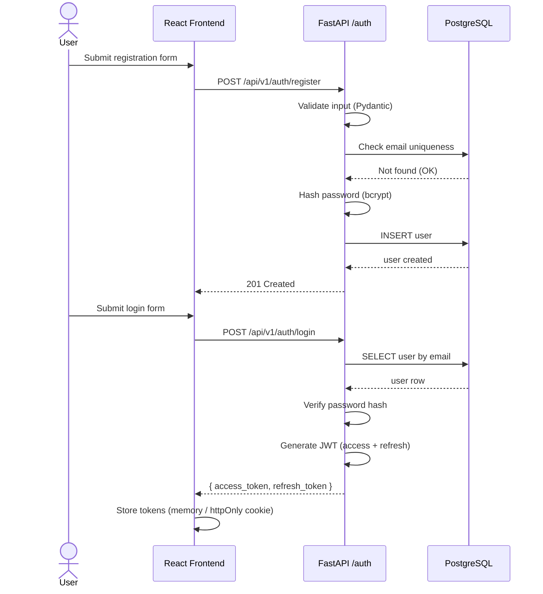
```mermaid
sequenceDiagram
    actor User
    participant FE as React Frontend
    participant API as FastAPI /auth
    participant DB as PostgreSQL

    User->>FE: Submit registration form
    FE->>API: POST /api/v1/auth/register
    API->>API: Validate input (Pydantic)
    API->>DB: Check email uniqueness
    DB-->>API: Not found (OK)
    API->>API: Hash password (bcrypt)
    API->>DB: INSERT user
    DB-->>API: user created
    API-->>FE: 201 Created

    User->>FE: Submit login form
    FE->>API: POST /api/v1/auth/login
    API->>DB: SELECT user by email
    DB-->>API: user row
    API->>API: Verify password hash
    API->>API: Generate JWT (access + refresh)
    API-->>FE: { access_token, refresh_token }
    FE->>FE: Store tokens (memory / httpOnly cookie)
```

### 2.2 Authenticated Request + RBAC Guard

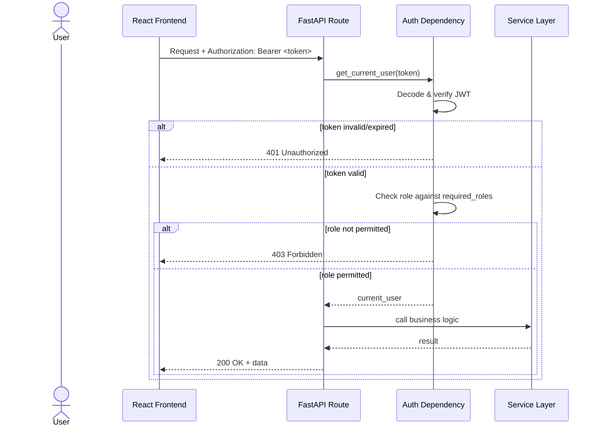
```mermaid
sequenceDiagram
    actor User
    participant FE as React Frontend
    participant API as FastAPI Route
    participant Dep as Auth Dependency
    participant Svc as Service Layer

    FE->>API: Request + Authorization: Bearer <token>
    API->>Dep: get_current_user(token)
    Dep->>Dep: Decode & verify JWT
    alt token invalid/expired
        Dep-->>FE: 401 Unauthorized
    else token valid
        Dep->>Dep: Check role against required_roles
        alt role not permitted
            Dep-->>FE: 403 Forbidden
        else role permitted
            Dep-->>API: current_user
            API->>Svc: call business logic
            Svc-->>API: result
            API-->>FE: 200 OK + data
        end
    end
```

### 2.3 Token Refresh Flow

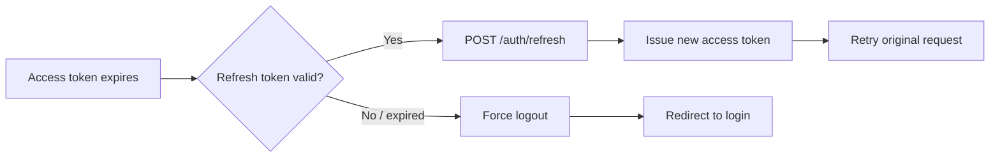
```mermaid
flowchart LR
    A[Access token expires] --> B{Refresh token valid?}
    B -- Yes --> C[POST /auth/refresh]
    C --> D[Issue new access token]
    D --> E[Retry original request]
    B -- No / expired --> F[Force logout]
    F --> G[Redirect to login]
```

---

## 3. Attendance Flow

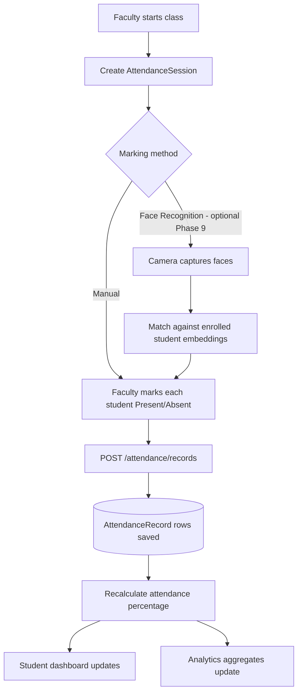
```mermaid
flowchart TD
    A[Faculty starts class] --> B[Create AttendanceSession]
    B --> C{Marking method}
    C -->|Manual| D[Faculty marks each student Present/Absent]
    C -->|Face Recognition - optional Phase 9| E[Camera captures faces]
    E --> F[Match against enrolled student embeddings]
    F --> D
    D --> G[POST /attendance/records]
    G --> H[(AttendanceRecord rows saved)]
    H --> I[Recalculate attendance percentage]
    I --> J[Student dashboard updates]
    I --> K[Analytics aggregates update]
```

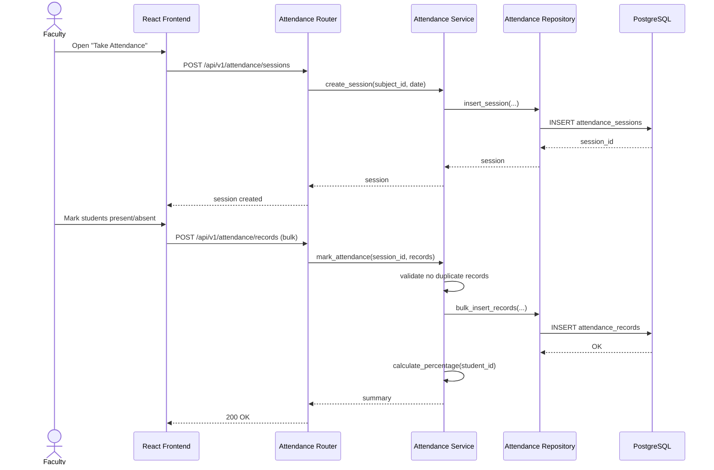
```mermaid
sequenceDiagram
    actor Faculty
    participant FE as React Frontend
    participant API as Attendance Router
    participant Svc as Attendance Service
    participant Repo as Attendance Repository
    participant DB as PostgreSQL

    Faculty->>FE: Open "Take Attendance"
    FE->>API: POST /api/v1/attendance/sessions
    API->>Svc: create_session(subject_id, date)
    Svc->>Repo: insert_session(...)
    Repo->>DB: INSERT attendance_sessions
    DB-->>Repo: session_id
    Repo-->>Svc: session
    Svc-->>API: session
    API-->>FE: session created

    Faculty->>FE: Mark students present/absent
    FE->>API: POST /api/v1/attendance/records (bulk)
    API->>Svc: mark_attendance(session_id, records)
    Svc->>Svc: validate no duplicate records
    Svc->>Repo: bulk_insert_records(...)
    Repo->>DB: INSERT attendance_records
    DB-->>Repo: OK
    Svc->>Svc: calculate_percentage(student_id)
    Svc-->>API: summary
    API-->>FE: 200 OK
```

---

## 4. Timetable Flow

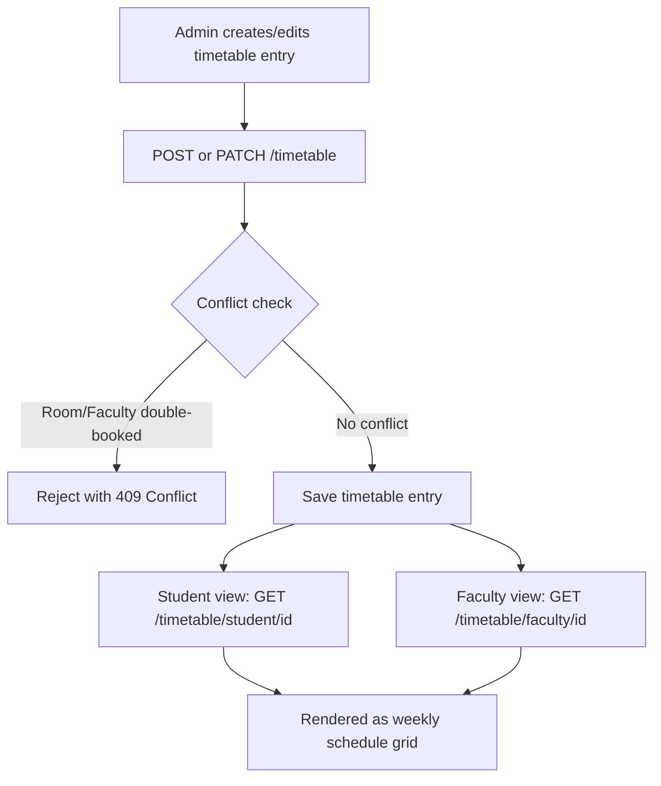
```mermaid
flowchart TD
    A[Admin creates/edits timetable entry] --> B[POST or PATCH /timetable]
    B --> C{Conflict check}
    C -->|Room/Faculty double-booked| D[Reject with 409 Conflict]
    C -->|No conflict| E[Save timetable entry]
    E --> F[Student view: GET /timetable/student/id]
    E --> G[Faculty view: GET /timetable/faculty/id]
    F --> H[Rendered as weekly schedule grid]
    G --> H
```

---

## 5. Assignment Lifecycle

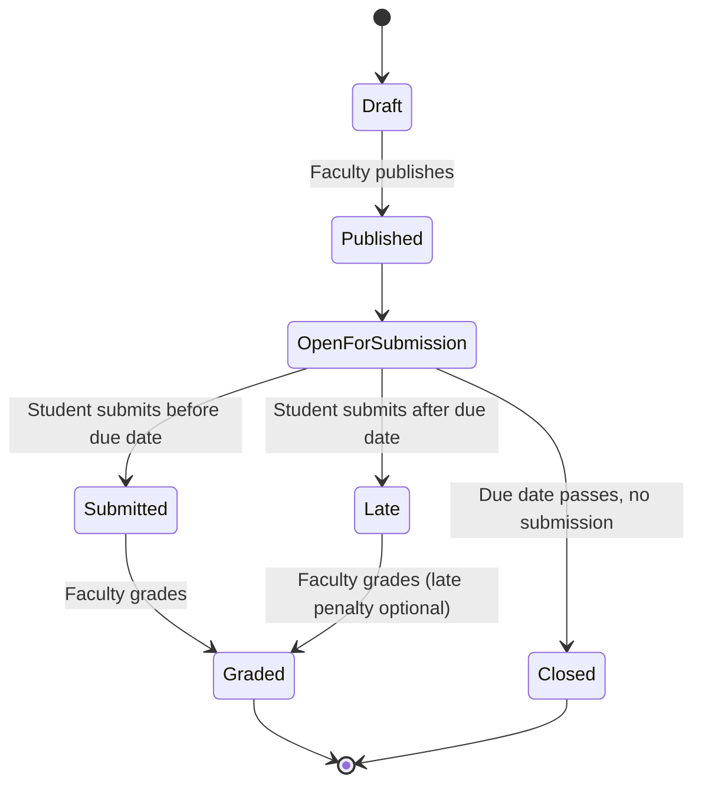
```mermaid
stateDiagram-v2
    [*] --> Draft
    Draft --> Published : Faculty publishes
    Published --> OpenForSubmission
    OpenForSubmission --> Submitted : Student submits before due date
    OpenForSubmission --> Late : Student submits after due date
    Submitted --> Graded : Faculty grades
    Late --> Graded : Faculty grades (late penalty optional)
    Graded --> [*]
    OpenForSubmission --> Closed : Due date passes, no submission
    Closed --> [*]
```

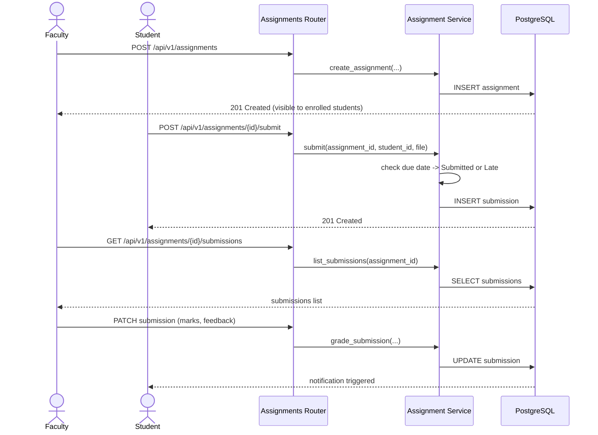
```mermaid
sequenceDiagram
    actor Faculty
    actor Student
    participant API as Assignments Router
    participant Svc as Assignment Service
    participant DB as PostgreSQL

    Faculty->>API: POST /api/v1/assignments
    API->>Svc: create_assignment(...)
    Svc->>DB: INSERT assignment
    DB-->>Faculty: 201 Created (visible to enrolled students)

    Student->>API: POST /api/v1/assignments/{id}/submit
    API->>Svc: submit(assignment_id, student_id, file)
    Svc->>Svc: check due date -> Submitted or Late
    Svc->>DB: INSERT submission
    DB-->>Student: 201 Created

    Faculty->>API: GET /api/v1/assignments/{id}/submissions
    API->>Svc: list_submissions(assignment_id)
    Svc->>DB: SELECT submissions
    DB-->>Faculty: submissions list

    Faculty->>API: PATCH submission (marks, feedback)
    API->>Svc: grade_submission(...)
    Svc->>DB: UPDATE submission
    DB-->>Student: notification triggered
```

---

## 6. Notices Flow

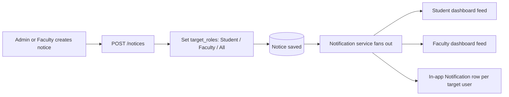
```mermaid
flowchart LR
    A[Admin or Faculty creates notice] --> B[POST /notices]
    B --> C[Set target_roles: Student / Faculty / All]
    C --> D[(Notice saved)]
    D --> E[Notification service fans out]
    E --> F[Student dashboard feed]
    E --> G[Faculty dashboard feed]
    E --> H[In-app Notification row per target user]
```

---

## 7. Document Upload & RAG Ingestion Pipeline

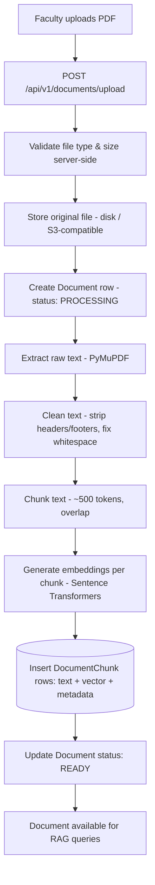
```mermaid
flowchart TD
    A[Faculty uploads PDF] --> B[POST /api/v1/documents/upload]
    B --> C[Validate file type & size server-side]
    C --> D[Store original file - disk / S3-compatible]
    D --> E[Create Document row - status: PROCESSING]
    E --> F[Extract raw text - PyMuPDF]
    F --> G[Clean text - strip headers/footers, fix whitespace]
    G --> H[Chunk text - ~500 tokens, overlap]
    H --> I[Generate embeddings per chunk - Sentence Transformers]
    I --> J[(Insert DocumentChunk rows: text + vector + metadata)]
    J --> K[Update Document status: READY]
    K --> L[Document available for RAG queries]
```

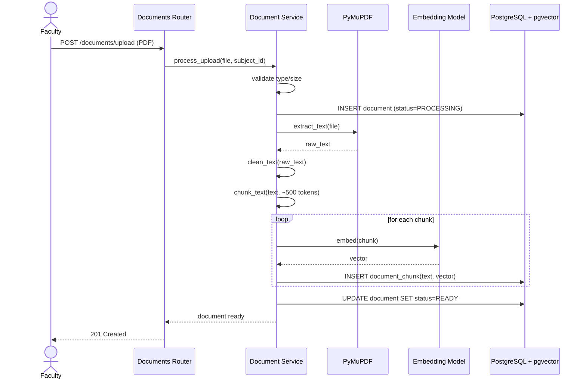
```mermaid
sequenceDiagram
    actor Faculty
    participant API as Documents Router
    participant Svc as Document Service
    participant Parser as PyMuPDF
    participant Embed as Embedding Model
    participant DB as PostgreSQL + pgvector

    Faculty->>API: POST /documents/upload (PDF)
    API->>Svc: process_upload(file, subject_id)
    Svc->>Svc: validate type/size
    Svc->>DB: INSERT document (status=PROCESSING)
    Svc->>Parser: extract_text(file)
    Parser-->>Svc: raw_text
    Svc->>Svc: clean_text(raw_text)
    Svc->>Svc: chunk_text(text, ~500 tokens)
    loop for each chunk
        Svc->>Embed: embed(chunk)
        Embed-->>Svc: vector
        Svc->>DB: INSERT document_chunk(text, vector)
    end
    Svc->>DB: UPDATE document SET status=READY
    Svc-->>API: document ready
    API-->>Faculty: 201 Created
```

---

## 8. RAG Query Pipeline

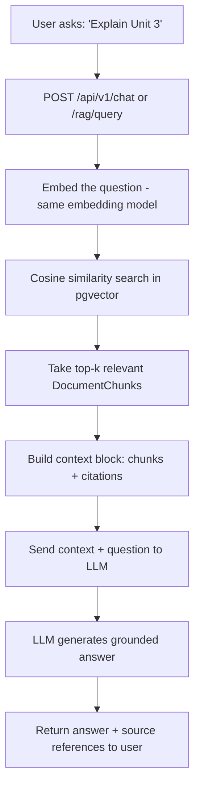
```mermaid
flowchart TD
    A[User asks: 'Explain Unit 3'] --> B[POST /api/v1/chat or /rag/query]
    B --> C[Embed the question - same embedding model]
    C --> D[Cosine similarity search in pgvector]
    D --> E[Take top-k relevant DocumentChunks]
    E --> F[Build context block: chunks + citations]
    F --> G[Send context + question to LLM]
    G --> H[LLM generates grounded answer]
    H --> I[Return answer + source references to user]
```

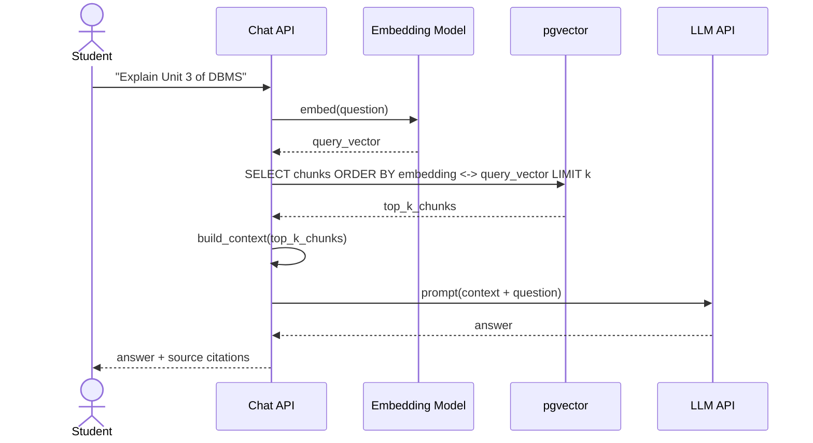
```mermaid
sequenceDiagram
    actor Student
    participant Chat as Chat API
    participant Embed as Embedding Model
    participant DB as pgvector
    participant LLM as LLM API

    Student->>Chat: "Explain Unit 3 of DBMS"
    Chat->>Embed: embed(question)
    Embed-->>Chat: query_vector
    Chat->>DB: SELECT chunks ORDER BY embedding <-> query_vector LIMIT k
    DB-->>Chat: top_k_chunks
    Chat->>Chat: build_context(top_k_chunks)
    Chat->>LLM: prompt(context + question)
    LLM-->>Chat: answer
    Chat-->>Student: answer + source citations
```

---

## 9. AI Chatbot Intent Router

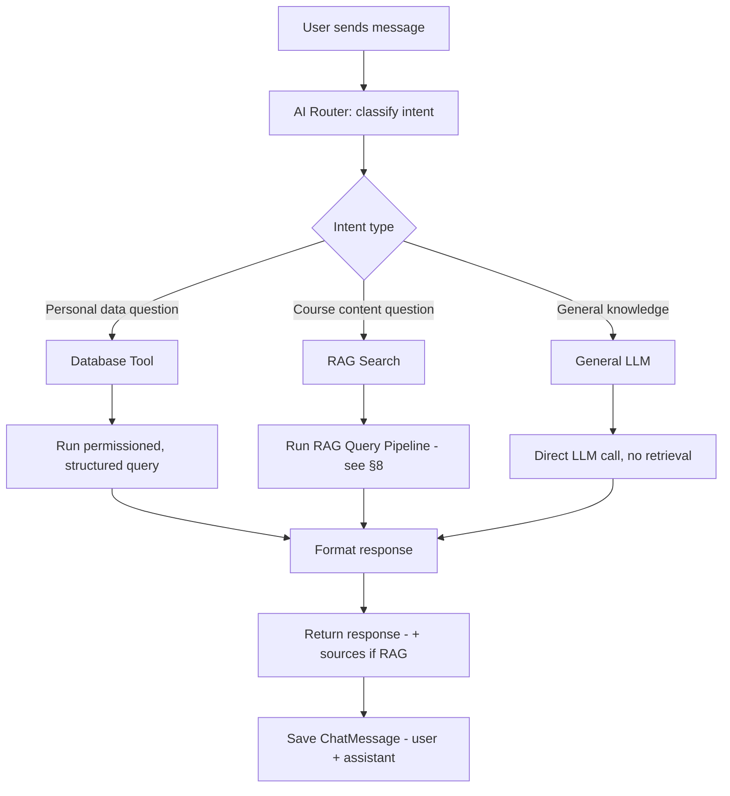
```mermaid
flowchart TD
    A[User sends message] --> B[AI Router: classify intent]
    B --> C{Intent type}
    C -->|Personal data question| D[Database Tool]
    C -->|Course content question| E[RAG Search]
    C -->|General knowledge| F[General LLM]
    D --> G[Run permissioned, structured query]
    E --> H[Run RAG Query Pipeline - see §8]
    F --> I[Direct LLM call, no retrieval]
    G --> J[Format response]
    H --> J
    I --> J
    J --> K[Return response - + sources if RAG]
    K --> L[Save ChatMessage - user + assistant]
```

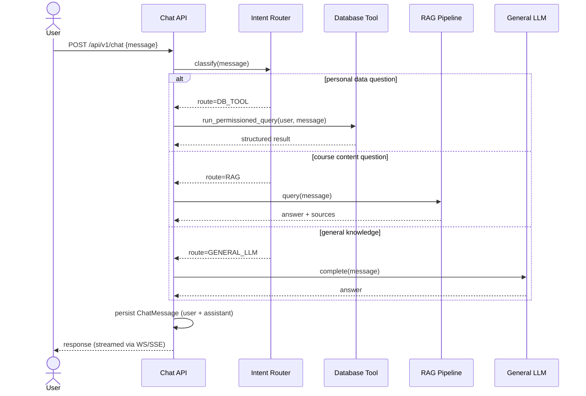
```mermaid
sequenceDiagram
    actor User
    participant Chat as Chat API
    participant Router as Intent Router
    participant DBTool as Database Tool
    participant RAG as RAG Pipeline
    participant LLM as General LLM

    User->>Chat: POST /api/v1/chat {message}
    Chat->>Router: classify(message)
    alt personal data question
        Router-->>Chat: route=DB_TOOL
        Chat->>DBTool: run_permissioned_query(user, message)
        DBTool-->>Chat: structured result
    else course content question
        Router-->>Chat: route=RAG
        Chat->>RAG: query(message)
        RAG-->>Chat: answer + sources
    else general knowledge
        Router-->>Chat: route=GENERAL_LLM
        Chat->>LLM: complete(message)
        LLM-->>Chat: answer
    end
    Chat->>Chat: persist ChatMessage (user + assistant)
    Chat-->>User: response (streamed via WS/SSE)
```

---

## 10. Notifications Flow

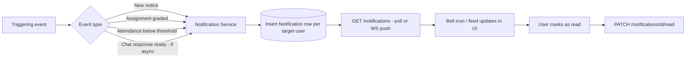
```mermaid
flowchart LR
    A[Triggering event] --> B{Event type}
    B -->|New notice| C[Notification Service]
    B -->|Assignment graded| C
    B -->|Attendance below threshold| C
    B -->|Chat response ready - if async| C
    C --> D[(Insert Notification row per target user)]
    D --> E[GET /notifications - poll or WS push]
    E --> F[Bell icon / feed updates in UI]
    F --> G[User marks as read]
    G --> H[PATCH /notifications/id/read]
```

---

## 11. Backend Request Lifecycle (Four-Layer Pattern)

Applies to every feature module (`attendance`, `timetable`, `assignments`, `notices`, `documents`, etc.) — see [`ARCHITECTURE.md §4`](./ARCHITECTURE.md#4-backend-architecture).

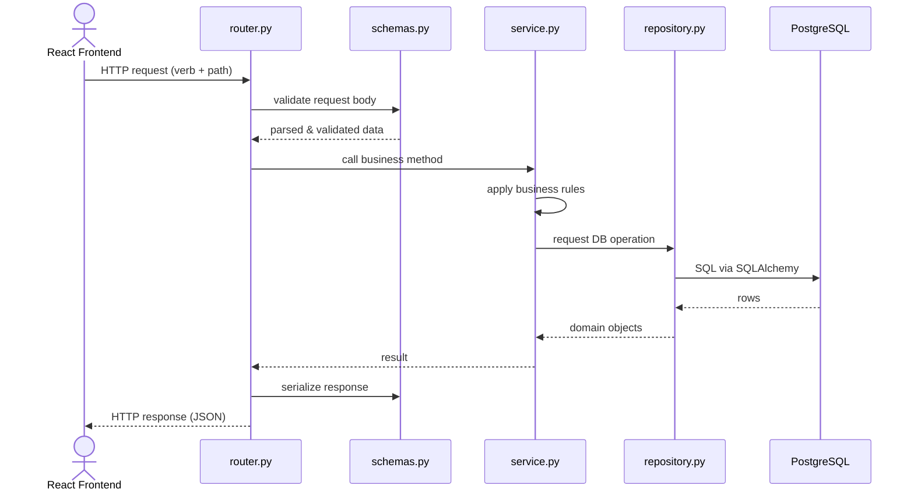
```mermaid
sequenceDiagram
    actor Client as React Frontend
    participant Router as router.py
    participant Schema as schemas.py
    participant Service as service.py
    participant Repo as repository.py
    participant DB as PostgreSQL

    Client->>Router: HTTP request (verb + path)
    Router->>Schema: validate request body
    Schema-->>Router: parsed & validated data
    Router->>Service: call business method
    Service->>Service: apply business rules
    Service->>Repo: request DB operation
    Repo->>DB: SQL via SQLAlchemy
    DB-->>Repo: rows
    Repo-->>Service: domain objects
    Service-->>Router: result
    Router->>Schema: serialize response
    Router-->>Client: HTTP response (JSON)
```

---

## 12. State Diagrams

### 12.1 Document Processing States

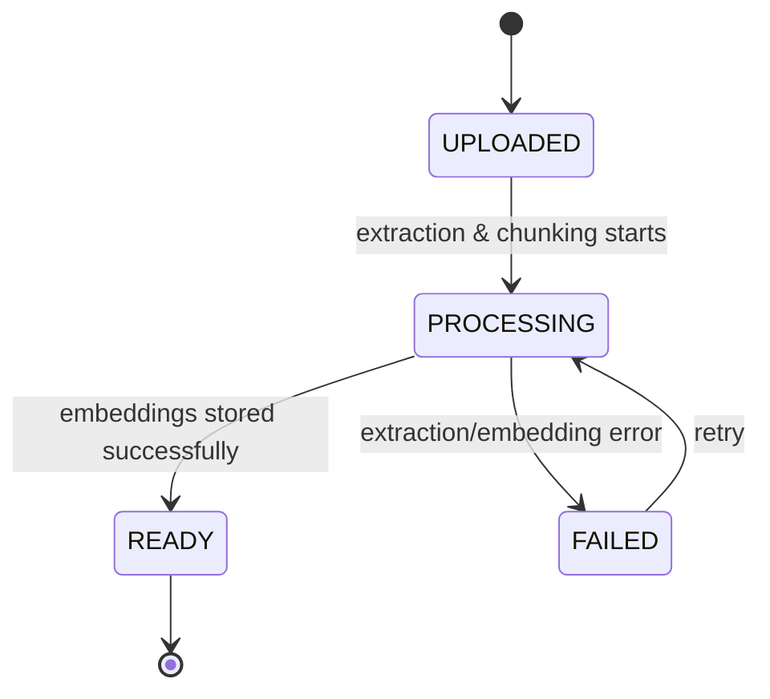
```mermaid
stateDiagram-v2
    [*] --> UPLOADED
    UPLOADED --> PROCESSING : extraction & chunking starts
    PROCESSING --> READY : embeddings stored successfully
    PROCESSING --> FAILED : extraction/embedding error
    FAILED --> PROCESSING : retry
    READY --> [*]
```

### 12.2 JWT Session State (Client-Side)

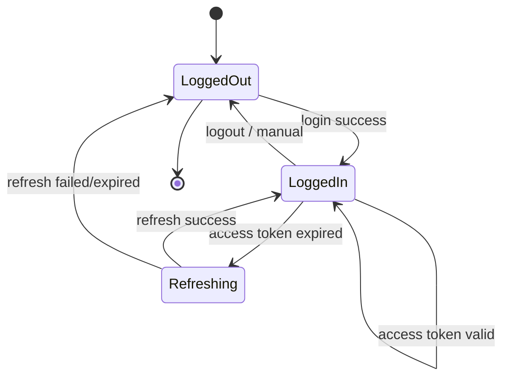
```mermaid
stateDiagram-v2
    [*] --> LoggedOut
    LoggedOut --> LoggedIn : login success
    LoggedIn --> LoggedIn : access token valid
    LoggedIn --> Refreshing : access token expired
    Refreshing --> LoggedIn : refresh success
    Refreshing --> LoggedOut : refresh failed/expired
    LoggedIn --> LoggedOut : logout / manual
    LoggedOut --> [*]
```

---

## Keeping These Diagrams in Sync

- Update this file whenever a new module, endpoint, or table is added to `ARCHITECTURE.md` or `DB_SCHEMA.md`.
- When prompting an AI coding tool for a new module, paste the relevant diagram(s) from this file alongside the architecture text — the visual flow often prevents the AI from inventing an inconsistent request/response shape.
- Prefer editing the Mermaid source directly over describing changes in prose; diagrams that drift from the code are worse than no diagrams.
