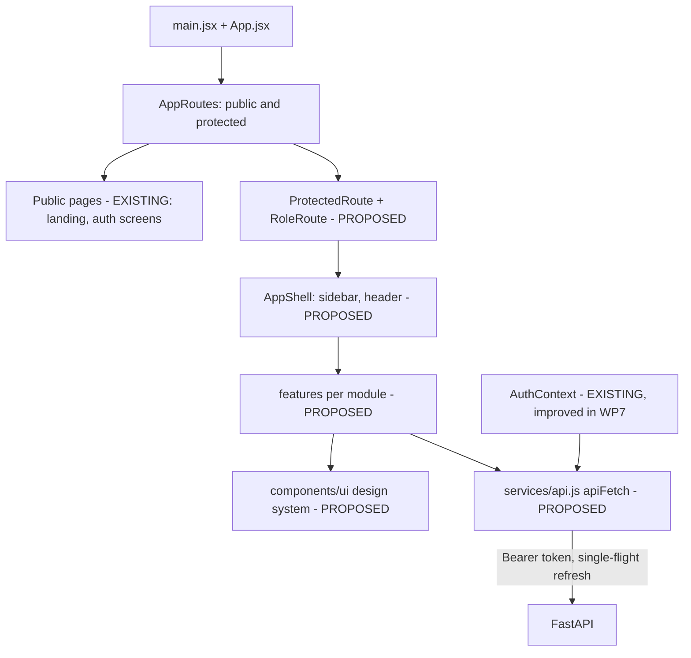

# Diagram 02 — Frontend architecture

**Status:** EXISTING parts marked; the rest PROPOSED

```mermaid
flowchart TB
    M["main.jsx + App.jsx"] --> RT["AppRoutes: public and protected"]
    RT --> PUB["Public pages - EXISTING: landing, auth screens"]
    RT --> GRD["ProtectedRoute + RoleRoute - PROPOSED"]
    GRD --> SH["AppShell: sidebar, header - PROPOSED"]
    SH --> FE["features per module - PROPOSED"]
    FE --> UI["components/ui design system - PROPOSED"]
    FE --> API["services/api.js apiFetch - PROPOSED"]
    AC["AuthContext - EXISTING, improved in WP7"] --> API
    API -->|"Bearer token, single-flight refresh"| BE["FastAPI"]
```

Existing auth screens are preserved; new code lives in new folders (doc 06).
