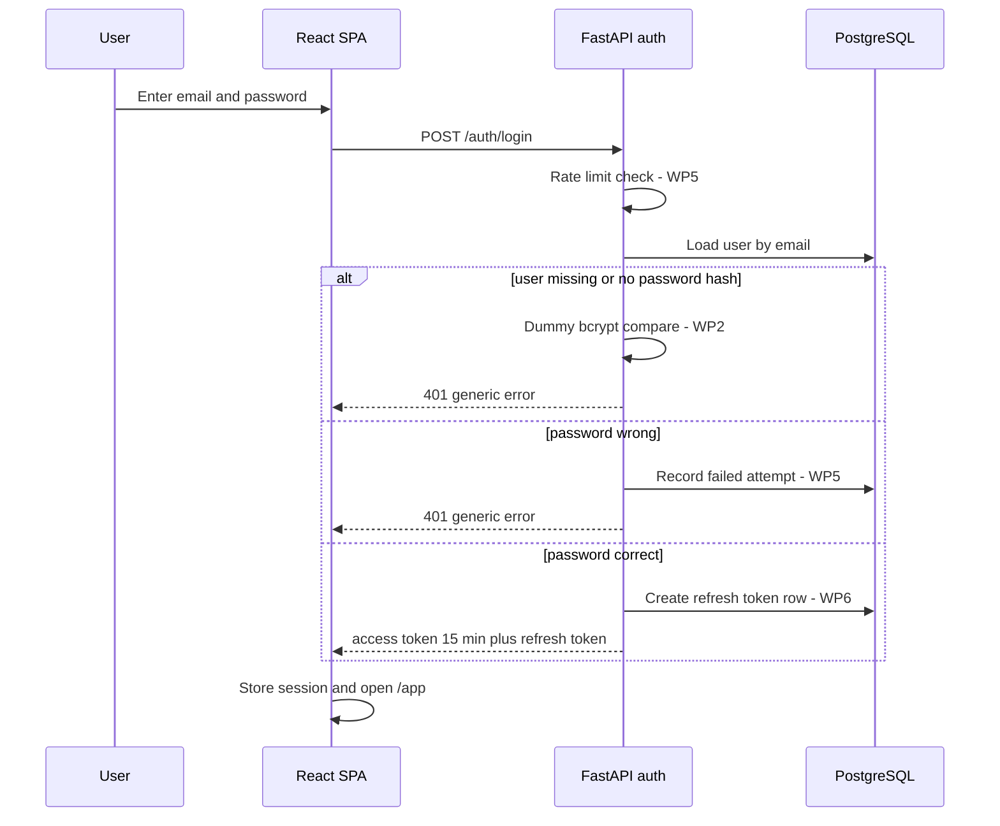

# Diagram 05 — Authentication workflow (target)

**Status:** EXISTING flow with PROPOSED fixes marked

```mermaid
sequenceDiagram
    participant U as User
    participant FE as React SPA
    participant API as FastAPI auth
    participant DB as PostgreSQL
    U->>FE: Enter email and password
    FE->>API: POST /auth/login
    API->>API: Rate limit check - WP5
    API->>DB: Load user by email
    alt user missing or no password hash
        API->>API: Dummy bcrypt compare - WP2
        API-->>FE: 401 generic error
    else password wrong
        API->>DB: Record failed attempt - WP5
        API-->>FE: 401 generic error
    else password correct
        API->>DB: Create refresh token row - WP6
        API-->>FE: access token 15 min plus refresh token
    end
    FE->>FE: Store session and open /app
```

Fixes C1 (null-hash bypass), H3 and H4 are overlaid on the existing login flow.
