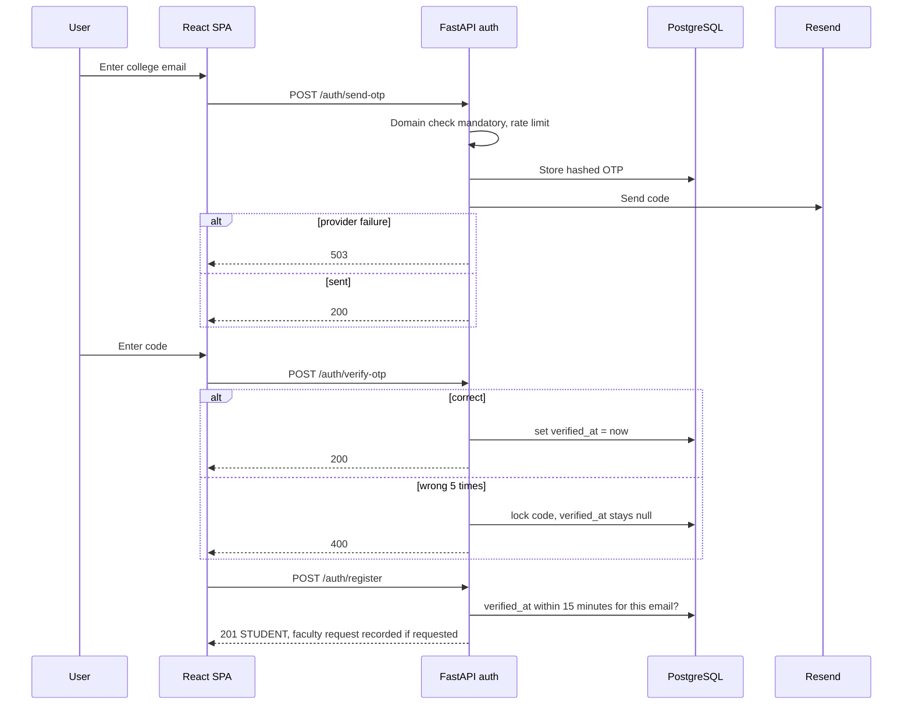

# Diagram 06 — OTP verification workflow (target)

**Status:** EXISTING flow with PROPOSED fix for C2

```mermaid
sequenceDiagram
    participant U as User
    participant FE as React SPA
    participant API as FastAPI auth
    participant DB as PostgreSQL
    participant E as Resend
    U->>FE: Enter college email
    FE->>API: POST /auth/send-otp
    API->>API: Domain check mandatory, rate limit
    API->>DB: Store hashed OTP
    API->>E: Send code
    alt provider failure
        API-->>FE: 503
    else sent
        API-->>FE: 200
    end
    U->>FE: Enter code
    FE->>API: POST /auth/verify-otp
    alt correct
        API->>DB: set verified_at = now
        API-->>FE: 200
    else wrong 5 times
        API->>DB: lock code, verified_at stays null
        API-->>FE: 400
    end
    FE->>API: POST /auth/register
    API->>DB: verified_at within 15 minutes for this email?
    API-->>FE: 201 STUDENT, faculty request recorded if requested
```

Lockout can never produce a verified state.
