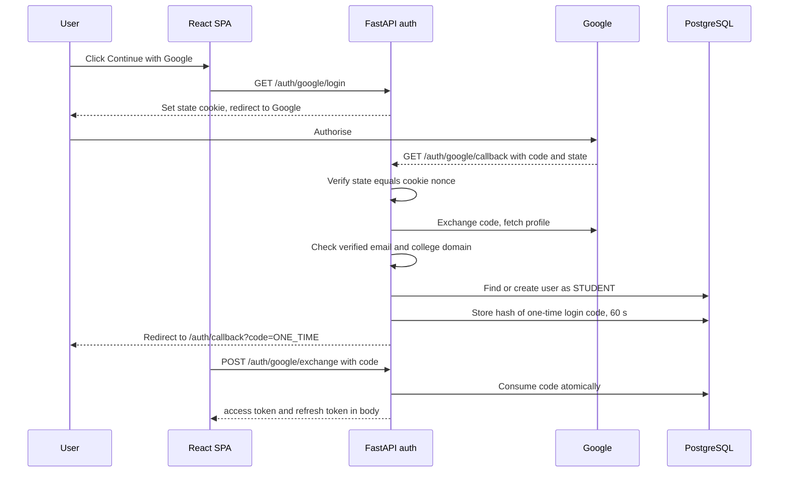

# Diagram 07 — Google OAuth workflow (target)

**Status:** EXISTING redirect flow; one-time code exchange PROPOSED (WP4)

```mermaid
sequenceDiagram
    participant U as User
    participant FE as React SPA
    participant API as FastAPI auth
    participant G as Google
    participant DB as PostgreSQL
    U->>FE: Click Continue with Google
    FE->>API: GET /auth/google/login
    API-->>U: Set state cookie, redirect to Google
    U->>G: Authorise
    G-->>API: GET /auth/google/callback with code and state
    API->>API: Verify state equals cookie nonce
    API->>G: Exchange code, fetch profile
    API->>API: Check verified email and college domain
    API->>DB: Find or create user as STUDENT
    API->>DB: Store hash of one-time login code, 60 s
    API-->>U: Redirect to /auth/callback?code=ONE_TIME
    FE->>API: POST /auth/google/exchange with code
    API->>DB: Consume code atomically
    API-->>FE: access token and refresh token in body
```

No token ever appears in a URL.
