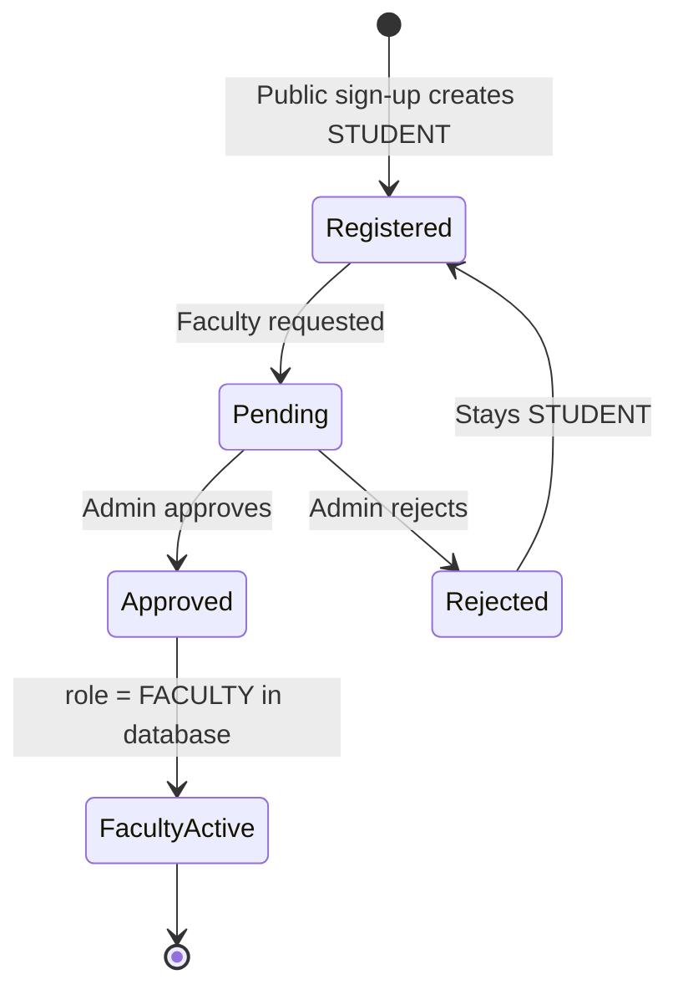

# Diagram 08 — Role approval workflow

**Status:** PROPOSED (WP2)

```mermaid
stateDiagram-v2
    [*] --> Registered: Public sign-up creates STUDENT
    Registered --> Pending: Faculty requested
    Pending --> Approved: Admin approves
    Pending --> Rejected: Admin rejects
    Approved --> FacultyActive: role = FACULTY in database
    Rejected --> Registered: Stays STUDENT
    FacultyActive --> [*]
```

Admin accounts are never created through this workflow; see doc 12.
