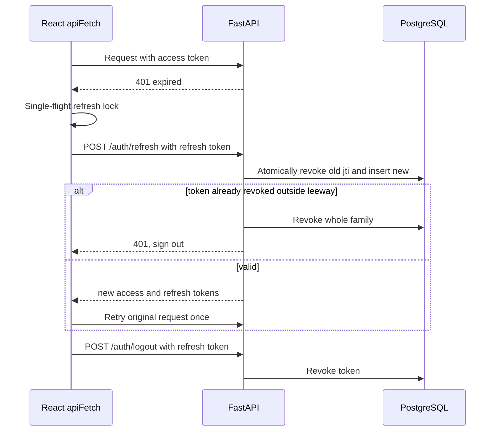

# Diagram 09 — JWT access and refresh-token workflow (target)

**Status:** PROPOSED (WP6, WP7)

```mermaid
sequenceDiagram
    participant FE as React apiFetch
    participant API as FastAPI
    participant DB as PostgreSQL
    FE->>API: Request with access token
    API-->>FE: 401 expired
    FE->>FE: Single-flight refresh lock
    FE->>API: POST /auth/refresh with refresh token
    API->>DB: Atomically revoke old jti and insert new
    alt token already revoked outside leeway
        API->>DB: Revoke whole family
        API-->>FE: 401, sign out
    else valid
        API-->>FE: new access and refresh tokens
        FE->>API: Retry original request once
    end
    FE->>API: POST /auth/logout with refresh token
    API->>DB: Revoke token
```

Concurrent tabs share one refresh via the lock; reuse detection protects against theft.
