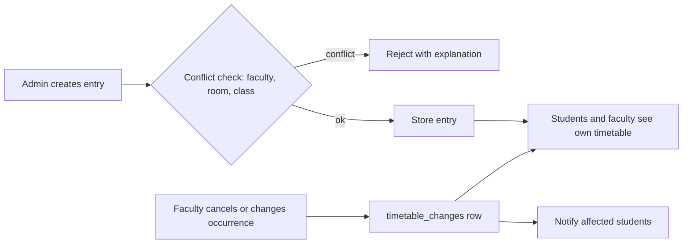

# Diagram 11 — Timetable workflow

**Status:** PROPOSED (P08)

```mermaid
flowchart LR
    AD["Admin creates entry"] --> CK{"Conflict check: faculty, room, class"}
    CK -->|conflict| RJ["Reject with explanation"]
    CK -->|ok| ST["Store entry"]
    ST --> VW["Students and faculty see own timetable"]
    FA["Faculty cancels or changes occurrence"] --> CH["timetable_changes row"]
    CH --> NT["Notify affected students"]
    CH --> VW
```

Only admins edit the master timetable.
