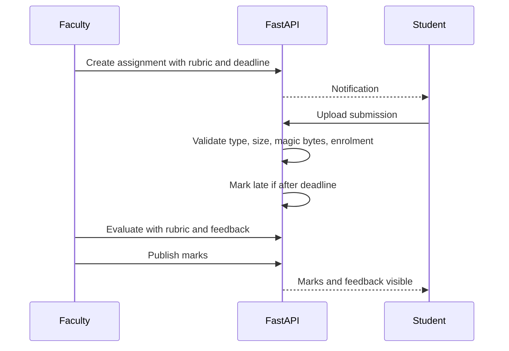

# Diagram 12 — Assignment workflow

**Status:** PROPOSED (P09)

```mermaid
sequenceDiagram
    participant F as Faculty
    participant API as FastAPI
    participant S as Student
    F->>API: Create assignment with rubric and deadline
    API-->>S: Notification
    S->>API: Upload submission
    API->>API: Validate type, size, magic bytes, enrolment
    API->>API: Mark late if after deadline
    F->>API: Evaluate with rubric and feedback
    F->>API: Publish marks
    API-->>S: Marks and feedback visible
```

Marks are hidden until published.
