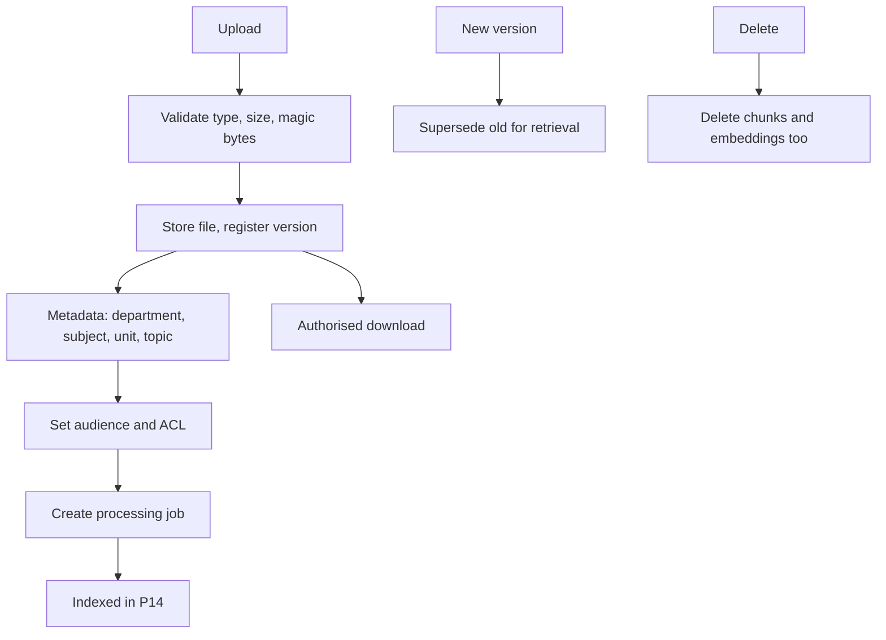

# Diagram 13 — Document management workflow

**Status:** PROPOSED (P11)

```mermaid
flowchart TB
    U["Upload"] --> V["Validate type, size, magic bytes"]
    V --> ST["Store file, register version"]
    ST --> MD["Metadata: department, subject, unit, topic"]
    MD --> AC["Set audience and ACL"]
    AC --> JB["Create processing job"]
    JB --> IX["Indexed in P14"]
    ST --> DL["Authorised download"]
    VER["New version"] --> SUP["Supersede old for retrieval"]
    DEL["Delete"] --> PR["Delete chunks and embeddings too"]
```

One ACL function serves listing, download and retrieval.
