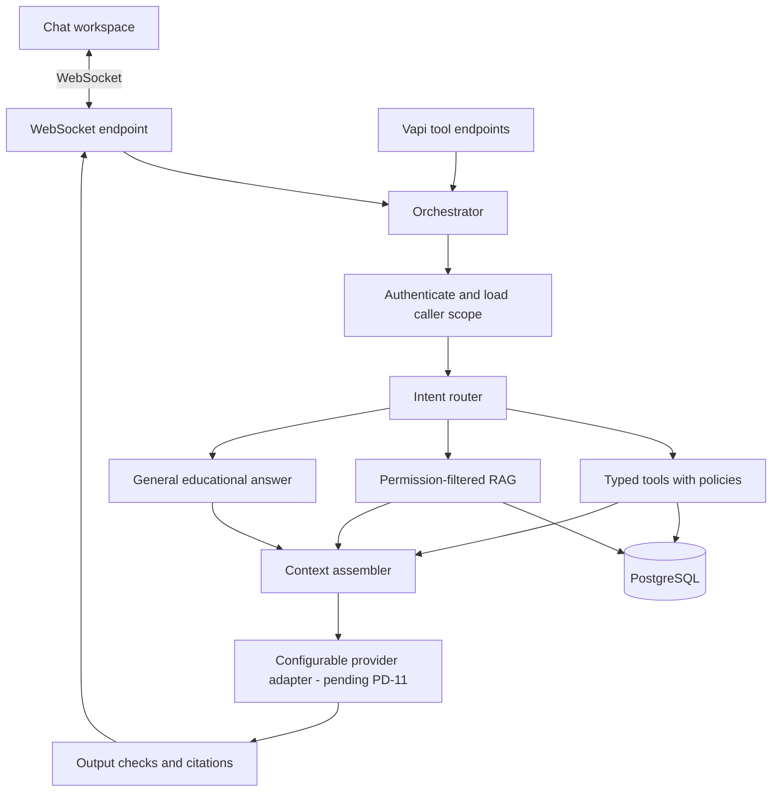

# Diagram 14 — CampusGPT AI architecture

**Status:** PROPOSED (P12–P14, P22)

```mermaid
flowchart TB
    UI["Chat workspace"] <-->|WebSocket| WSE["WebSocket endpoint"]
    WSE --> OR["Orchestrator"]
    VT["Vapi tool endpoints"] --> OR
    OR --> AU["Authenticate and load caller scope"]
    AU --> IR["Intent router"]
    IR --> TL["Typed tools with policies"]
    IR --> RG["Permission-filtered RAG"]
    IR --> GN["General educational answer"]
    TL --> DB[("PostgreSQL")]
    RG --> DB
    TL --> CX["Context assembler"]
    RG --> CX
    GN --> CX
    CX --> PV["Configurable provider adapter - pending PD-11"]
    PV --> OP["Output checks and citations"]
    OP --> WSE
```

Text and voice share the same orchestrator, tools and policies; the model never receives data the caller cannot see.
