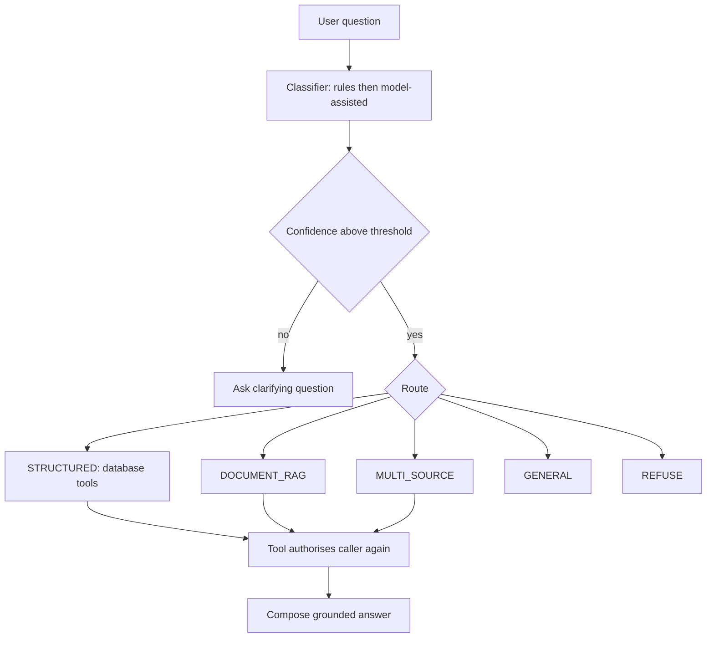

# Diagram 15 — Intent detection and routing workflow

**Status:** PROPOSED (P13)

```mermaid
flowchart TB
    Q["User question"] --> CL["Classifier: rules then model-assisted"]
    CL --> CF{"Confidence above threshold"}
    CF -->|no| CQ["Ask clarifying question"]
    CF -->|yes| RT{"Route"}
    RT --> S1["STRUCTURED: database tools"]
    RT --> S2["DOCUMENT_RAG"]
    RT --> S3["MULTI_SOURCE"]
    RT --> S4["GENERAL"]
    RT --> S5["REFUSE"]
    S1 --> AZ["Tool authorises caller again"]
    S2 --> AZ
    S3 --> AZ
    AZ --> ANS["Compose grounded answer"]
```

Routing never grants access; each tool authorises independently.
