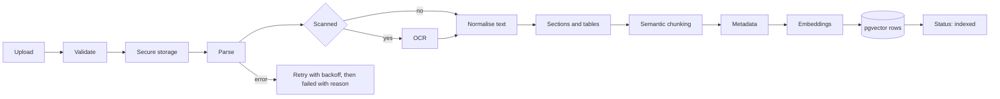

# Diagram 16 — RAG ingestion pipeline

**Status:** PROPOSED (P14)

```mermaid
flowchart LR
    A["Upload"] --> B["Validate"]
    B --> C["Secure storage"]
    C --> D["Parse"]
    D --> E{"Scanned"}
    E -->|yes| F["OCR"]
    E -->|no| G["Normalise text"]
    F --> G
    G --> H["Sections and tables"]
    H --> I["Semantic chunking"]
    I --> J["Metadata"]
    J --> K["Embeddings"]
    K --> L[("pgvector rows")]
    L --> M["Status: indexed"]
    D -->|error| X["Retry with backoff, then failed with reason"]
```

Jobs are database rows claimed with SKIP LOCKED by the worker.
