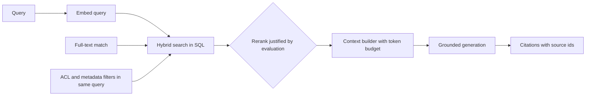

# Diagram 17 — RAG retrieval pipeline

**Status:** PROPOSED (P14)

```mermaid
flowchart LR
    Q["Query"] --> E["Embed query"]
    E --> H["Hybrid search in SQL"]
    FT["Full-text match"] --> H
    ACL["ACL and metadata filters in same query"] --> H
    H --> RR{"Rerank justified by evaluation"}
    RR --> CB["Context builder with token budget"]
    CB --> GEN["Grounded generation"]
    GEN --> CI["Citations with source ids"]
```

Filters are part of the query, not applied afterwards.
