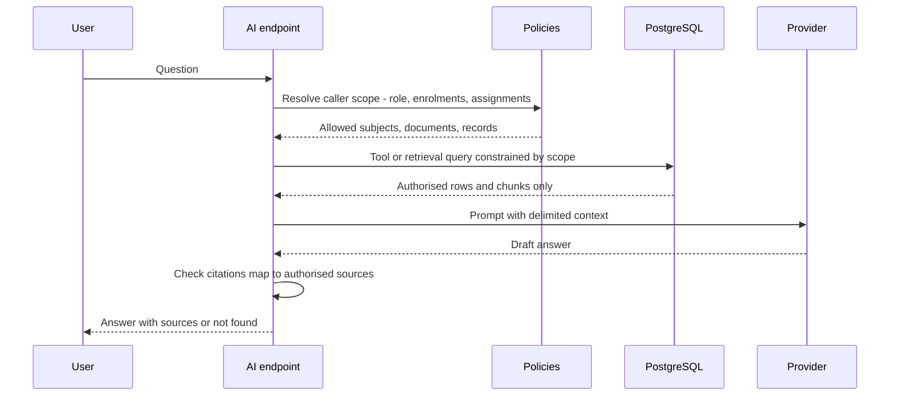

# Diagram 18 — Role-aware retrieval and authorisation workflow

**Status:** PROPOSED (P12–P14, P23)

```mermaid
sequenceDiagram
    participant U as User
    participant API as AI endpoint
    participant POL as Policies
    participant DB as PostgreSQL
    participant LLM as Provider
    U->>API: Question
    API->>POL: Resolve caller scope - role, enrolments, assignments
    POL-->>API: Allowed subjects, documents, records
    API->>DB: Tool or retrieval query constrained by scope
    DB-->>API: Authorised rows and chunks only
    API->>LLM: Prompt with delimited context
    LLM-->>API: Draft answer
    API->>API: Check citations map to authorised sources
    API-->>U: Answer with sources or not found
```

Unauthorised content never reaches the model prompt.
