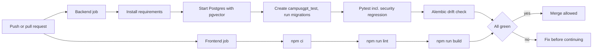

# Diagram 21 — CI/CD workflow

**Status:** PROPOSED (WP10)

```mermaid
flowchart LR
    PR["Push or pull request"] --> BJ["Backend job"]
    PR --> FJ["Frontend job"]
    BJ --> B1["Install requirements"]
    B1 --> B2["Start Postgres with pgvector"]
    B2 --> B3["Create campusgpt_test, run migrations"]
    B3 --> B4["Pytest incl. security regression"]
    B4 --> B5["Alembic drift check"]
    FJ --> F1["npm ci"]
    F1 --> F2["npm run lint"]
    F2 --> F3["npm run build"]
    B5 --> G{"All green"}
    F3 --> G
    G -->|yes| M["Merge allowed"]
    G -->|no| X["Fix before continuing"]
```

No next work package while CI is red.
