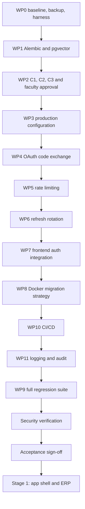

# Diagram 22 — Foundation stabilisation roadmap

**Status:** PROPOSED execution order

```mermaid
flowchart TB
    W0["WP0 baseline, backup, harness"] --> W1["WP1 Alembic and pgvector"]
    W1 --> W2["WP2 C1, C2, C3 and faculty approval"]
    W2 --> W3["WP3 production configuration"]
    W3 --> W4["WP4 OAuth code exchange"]
    W4 --> W5["WP5 rate limiting"]
    W5 --> W6["WP6 refresh rotation"]
    W6 --> W7["WP7 frontend auth integration"]
    W7 --> W8["WP8 Docker migration strategy"]
    W8 --> W10["WP10 CI/CD"]
    W10 --> W11["WP11 logging and audit"]
    W11 --> W9["WP9 full regression suite"]
    W9 --> SV["Security verification"]
    SV --> AC["Acceptance sign-off"]
    AC --> ST1["Stage 1: app shell and ERP"]
```

WP9 starts minimal in WP0 and completes here.
