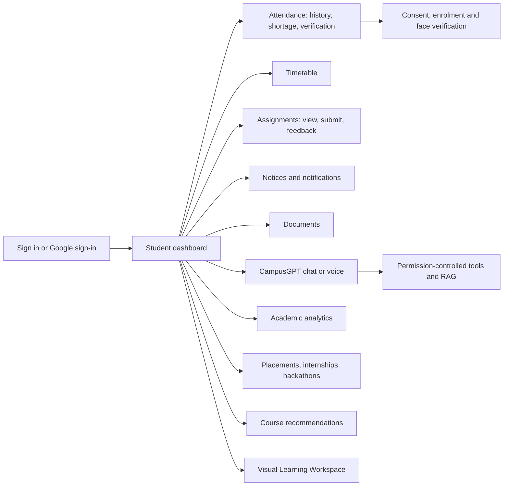

# Diagram 25 — Student workflow

**Status:** PROPOSED

```mermaid
flowchart LR
    L["Sign in or Google sign-in"] --> D["Student dashboard"]
    D --> AT["Attendance: history, shortage, verification"]
    D --> TT["Timetable"]
    D --> AS["Assignments: view, submit, feedback"]
    D --> NO["Notices and notifications"]
    D --> DC["Documents"]
    D --> CG["CampusGPT chat or voice"]
    D --> AN["Academic analytics"]
    D --> PL["Placements, internships, hackathons"]
    D --> CR["Course recommendations"]
    D --> VW["Visual Learning Workspace"]
    AT --> BV["Consent, enrolment and face verification"]
    CG --> CT["Permission-controlled tools and RAG"]
```

Every box is backed by authorised API calls scoped to the student.
