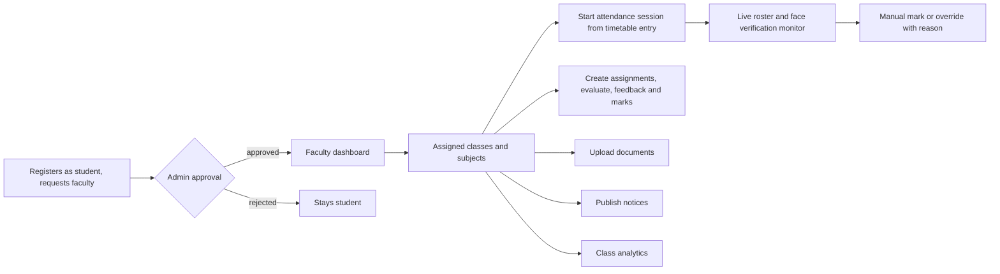

# Diagram 26 — Faculty workflow

**Status:** PROPOSED

```mermaid
flowchart LR
    R["Registers as student, requests faculty"] --> AP{"Admin approval"}
    AP -->|approved| FD["Faculty dashboard"]
    AP -->|rejected| ST["Stays student"]
    FD --> CL["Assigned classes and subjects"]
    CL --> SS["Start attendance session from timetable entry"]
    SS --> LR["Live roster and face verification monitor"]
    LR --> OV["Manual mark or override with reason"]
    CL --> AG["Create assignments, evaluate, feedback and marks"]
    CL --> DU["Upload documents"]
    CL --> NT["Publish notices"]
    CL --> AA["Class analytics"]
```

Access is limited to assigned classes; faculty never see raw biometric data.
