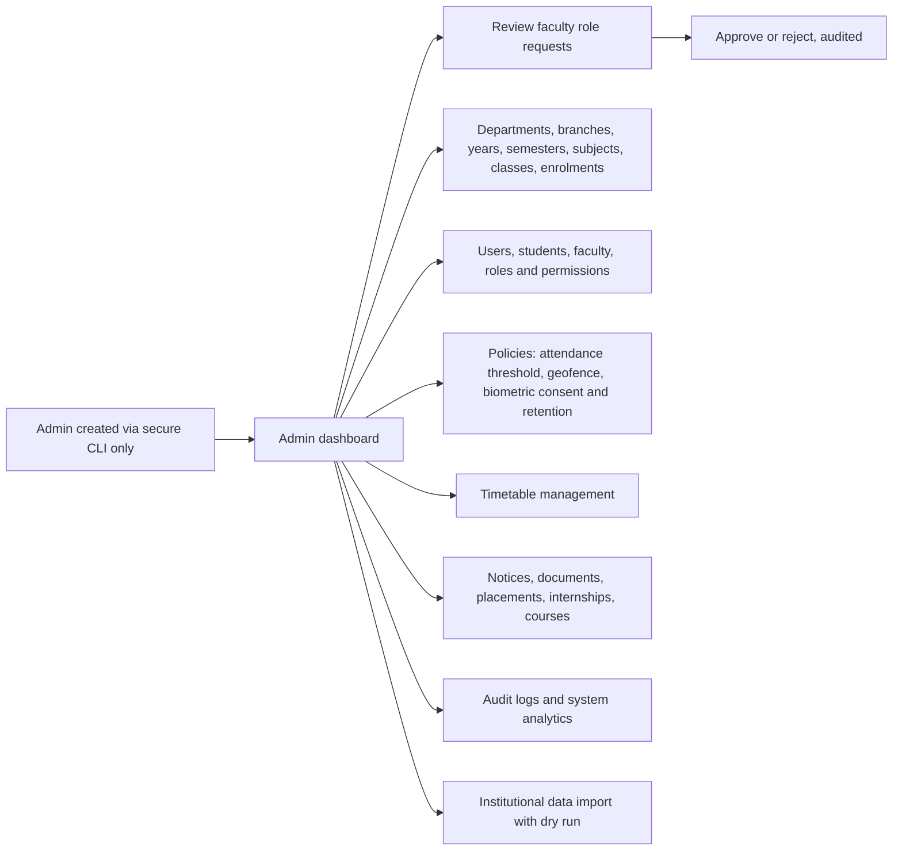

# Diagram 27 — Admin workflow

**Status:** PROPOSED

```mermaid
flowchart LR
    CLI["Admin created via secure CLI only"] --> AD["Admin dashboard"]
    AD --> RQ["Review faculty role requests"]
    RQ --> AP["Approve or reject, audited"]
    AD --> ST["Departments, branches, years, semesters, subjects, classes, enrolments"]
    AD --> US["Users, students, faculty, roles and permissions"]
    AD --> PO["Policies: attendance threshold, geofence, biometric consent and retention"]
    AD --> TT["Timetable management"]
    AD --> CT["Notices, documents, placements, internships, courses"]
    AD --> AU["Audit logs and system analytics"]
    AD --> IM["Institutional data import with dry run"]
```

Every administrative mutation is audited.
