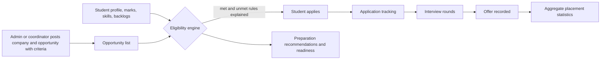

# Diagram 28 — Placement workflow

**Status:** PROPOSED (P16)

```mermaid
flowchart LR
    AD["Admin or coordinator posts company and opportunity with criteria"] --> OP["Opportunity list"]
    SP["Student profile, marks, skills, backlogs"] --> EL{"Eligibility engine"}
    OP --> EL
    EL -->|"met and unmet rules explained"| AP["Student applies"]
    AP --> TR["Application tracking"]
    TR --> IR["Interview rounds"]
    IR --> OF["Offer recorded"]
    OF --> ST["Aggregate placement statistics"]
    EL --> PR["Preparation recommendations and readiness"]
```

Statistics are aggregates only; individual offers are visible only to the owner and authorised staff.
